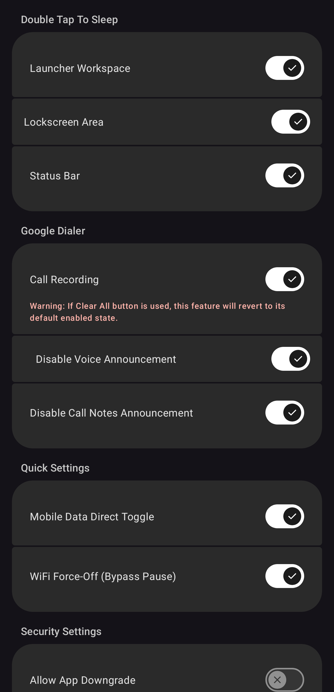
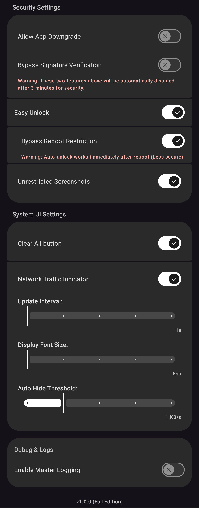
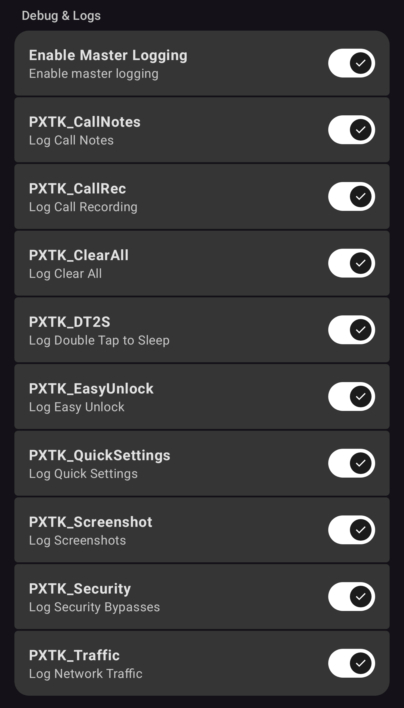

# PixelTweaks

**Version:** 1.0.0 (Master Release)
**Target:** Android 17 (Pixel), `libxposed` API 102 (LSPosed)

A professional, high-performance Xposed module tailored specifically for Google Pixel devices. This version consolidates all previous development optimizations into a stable v1.0.0 baseline.

## 📸 Preview

  
  &nbsp;&nbsp;
  
  &nbsp;&nbsp;
  

  <em>(Click any image to view full size)</em>

## ✨ Features (v1.0.0)

### 🎨 Double Tap To Sleep
- **Launcher Workspace**: Integrated support for double-tap gestures on the launcher workspace to sleep.
- **Lockscreen Area**: Integrated support for double-tap gestures on the lockscreen area to sleep.
- **Status Bar**: Integrated support for double-tap gestures on the status bar to sleep.

### 📞 Google Dialer
- **Enable Call Recording**: Unlocks native recording in Google Dialer via background DexKit scanning.
- **Disable Voice Announcement**: Blocks the voice warning at the start of call recording.
- **Disable Call Notes Announcement**: Silences AI recording and transcription announcements.

### ⚙️ Quick Settings
- **Mobile Data Direct Toggle**: Removes the confirmation dialog when switching to mobile data.
- **WiFi Force Off**: Bypasses the "Pause WiFi" behavior, forcing a complete shutdown when toggled.

### 🛡️ Security Settings
- **Allow App Downgrade**: Install older APKs over newer ones without data loss (auto-resets after 3 minutes).
- **Bypass Signature Verification**: Install modified APKs with different signatures (auto-resets after 3 minutes).
- **Easy Unlock**: Automatically dismisses the keyguard when the entered PIN/Password length matches the learned pattern.
- **Bypass Restriction**: Optional setting to allow auto-unlock immediately after system boot.
- **Unrestricted Screenshots**: Force-enable screenshots and recordings in restricted apps (Banking, Incognito).

### 📱 System UI Settings
- **Clear All button**: Adds a native-style "Clear all" button to the Pixel Launcher recents screen.
- **Network Traffic Indicator**: Real-time speed monitor in status bar with intensity-aware color syncing.

### 🐞 Debug & Logs
- **Enable Master Logging**: Standardized, low-overhead logging system with per-module toggles (**Debug build only**).

## 📦 Editions

| Feature | `lite` | `full` |
|---|:---:|:---:|
| Material 3 & Edge-to-Edge | ✅ | ✅ |
| Clear All button & Network Traffic Indicator | ✅ | ✅ |
| Security Settings & Easy Unlock | ✅ | ✅ |
| Double Tap To Sleep | ✅ | ✅ |
| Enable Call Recording | - | ✅ |
| Disable Voice Announcement | - | ✅ |
| Disable Call Notes Announcement | - | ✅ |
| Dependency Size | Minimum | Standard (DexKit) |

## 🛠️ Requirements & Installation

- **Root + LSPosed** (or any manager supporting `libxposed` API 102).
- **Android 17 (API 37).
- **Static Scope Enforcement**: System Framework, Phone, Pixel Launcher, System UI.

### Install
1. Build or download `pixel-tweaks-<flavor>-v1.0.0-<buildType>.apk`.
2. Install the APK and enable in LSPosed Manager.
3. Reboot your device.

## 📄 License

This project is licensed under the **GNU General Public License v3.0 (GPL-3.0)**.

GPL-3.0 was chosen deliberately, not because this project is a derivative work of
any GPL-licensed codebase — it isn't. It was chosen because its goals line up with
this project's own:

- Anyone can freely use, study, modify, and redistribute this code.
- Anyone is welcome to fork and continue maintaining this project if I ever stop.
- Any distributed modified version must also be released as open source under
  GPL-3.0 — this is the mechanism that keeps the project from being repackaged
  into a closed-source commercial product. This project is intended to remain
  free, both as in "freedom" and as in "no cost," and GPL-3.0's copyleft clause
  is what makes that durable even if I'm no longer the one maintaining it.

See [LICENSE](./LICENSE) for the full text.

## 📚 Credits & Acknowledgments

- **Inspiration**: Some early implementation ideas were inspired by
  [PixelXpert](https://github.com/siavash79/PixelXpert) by @siavash79 & @ElTifo.
  The current implementations use different technical approaches from the
  original project.
- **Technical Analysis**: Special thanks to
  [vvb2060/CallRecording](https://github.com/vvb2060/CallRecording) for the
  in-depth technical breakdown of Dialer internals.

### Thanks
- **Android Team**
- **@topjohnwu** for Magisk
- **@rovo89** for Xposed
- **LSPosed Team**
- **@luckypray** for DexKit
