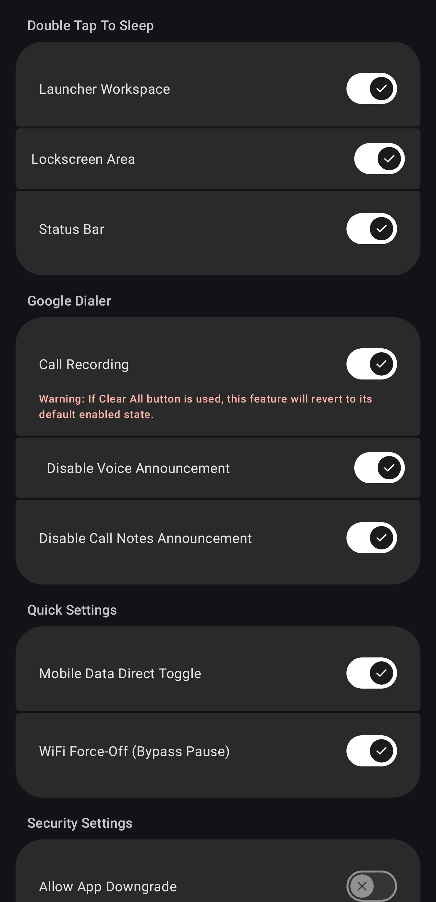
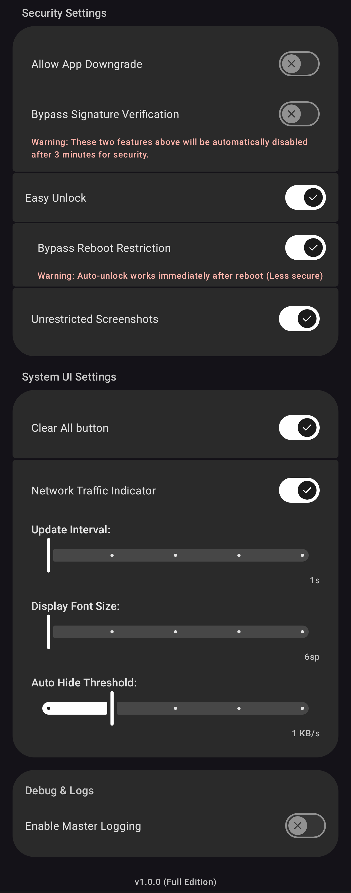
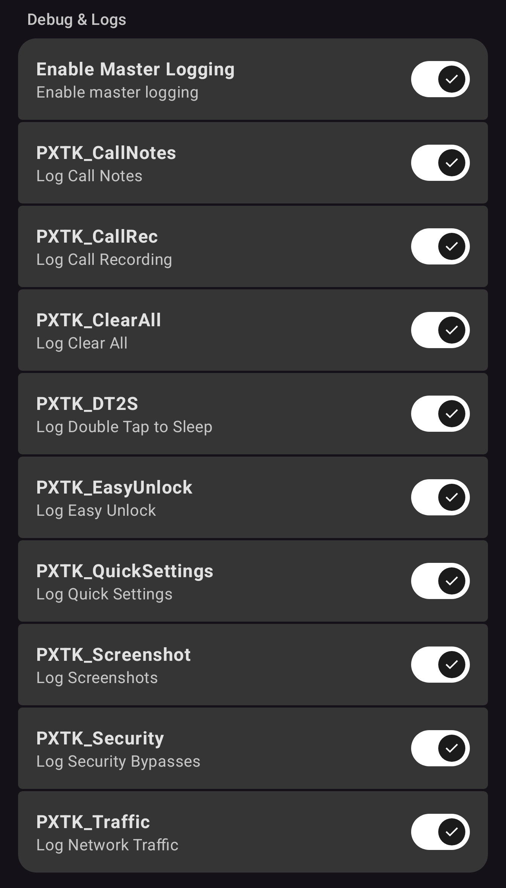

# PixelTweaks

<p align="center">
  
  
  
  
  
</p>

**Version:** v1.2.6 (Stable Release)  
**Target:** Android 17 (Pixel), `libxposed` API 102 (LSPosed)

**Language:** **English** | [繁體中文 (Traditional Chinese)](README_ZHT.md)

A professional, high-performance Xposed module tailored specifically for Google Pixel devices.

## 📸 Preview

<p align="center">
  <a href="art/screenshot1.png" target="_blank"></a>
  &nbsp;&nbsp;
  <a href="art/screenshot2.png" target="_blank"></a>
  &nbsp;&nbsp;
  <a href="art/screenshot3.png" target="_blank"></a>
</p>
<p align="center">
  <em>(Click any image to view full size)</em>
</p>

## ✨ Features (v1.2.6)

### 🎨 Double Tap To Sleep
- **Double Tap Launcher**: Integrated support for double-tap gestures on the launcher workspace to sleep (optimized with relaxed touch slop `1.5f` and `400ms` time window).
- **Double Tap Lockscreen**: Integrated support for double-tap gestures on the lockscreen area to sleep.
- **Double Tap Status Bar**: Integrated support for double-tap gestures on the status bar to sleep.

### ⚙️ Quick Settings
- **Direct Mobile Data Toggle**: Removes the confirmation dialog when switching to mobile data.
- **Force Wi-Fi Off**: Bypasses the "Pause WiFi" behavior, forcing a complete shutdown when toggled.

### 🛡️ Security Settings
- **Allow App Downgrade**: Install older APKs over newer ones without data loss (auto-resets after 3 minutes).
- **Bypass Signature Verification**: Install modified APKs with different signatures (auto-resets after 3 minutes).
- **Easy Unlock**: Automatically dismisses the keyguard when the entered PIN/Password length matches the learned pattern (with DE storage fallback & cross-process sync protection).
- **Bypass Restriction**: Optional setting to allow auto-unlock immediately after system boot.
- **Unrestricted Screenshots**: Force-enable screenshots and recordings in restricted apps (Banking, Incognito).

### 📱 System UI Settings
- **Camera Hole Energy Ring**: Dynamic battery energy ring rendered around the front camera cutout (`DisplayCutout`) featuring color status thresholds (<=20% Yellow, <=10% Red, >20% Cyan/Green), 3s HSV rainbow gradient pulse animation during charging, system Battery Saver mode orange sync (`#FF9500`), smooth 1-minute clock rotation, fine-tuning sliders for offset & stroke width, "Show Only While Charging" toggle, and automatic screen-off power saving.
- **Status Bar Battery Percent**: Displays a clean text battery percentage (e.g., "100%") on the far-right side of the status bar. Suppresses Android 17 stock battery views while dynamically matching status bar clock typography, theme colors, and charging pulse gradient.
- **Clear All Button**: Adds a native-style "Clear all" button to the Pixel Launcher recents screen.
- **Tablet Mode**: Dynamically calculates and applies target display density (`sw >= 600dp`) for tablet UI layout via pure LSPosed system server integration.
- **Network Traffic Indicator**: Real-time speed monitor in status bar with intensity-aware color syncing.

### 🔋 Battery Info
- **Show Battery Info**: Feature toggle to display 18 advanced hardware and real-time battery metrics (real-time wattage W, voltage V, current mA, charge cycles, calculated & chip capacity health scores, temperature °C, internal resistance mΩ, manufacture date & age, serial number, and current max charging limits) with 2s foreground auto-refresh (**requires Root**).

### 🌐 Per-App Language Selection
- **Multi-Language Support**: Native Per-App Language Selection supporting 18 global languages across Pixel device sales markets with a scrollable radio-button selection dialog.

### 🐞 Debug & Logs
- **Master Logging**: Standardized, low-overhead logging system with complete coverage across all functional modules (**Debug build only**).

## 🏗️ Architecture (v1.2.6)

PixelTweaks is built with modern Android **MVVM + Unidirectional Data Flow (UDF)** architecture:
- **`presentation/`**: `SettingsUiState` (Immutable State), `SettingsEvent` (Sealed Interface Intents), `SettingsViewModel` (StateFlow & Coroutine Timers).
- **`data/repository/`**: `SettingsRepository` (Handles CE/DE SharedPreferences & IPC Broadcasts).
- **`ui/`**: `SettingsActivity` & `SettingsScreen` (Pure Compose View Layer).

## 📝 Changelog

See [ChangeLogs.md](ChangeLogs.md) for the complete version release history and detailed changelogs.

## 🛠️ Requirements & Installation

- **Root + LSPosed** (or any manager supporting `libxposed` API 102).
- **Android 17 (API 37)** or newer.
- **Static Scope Enforcement**: System Framework, Pixel Launcher, System UI.

### Install
1. Build or download `pixel-tweaks-v1.2.6-<buildType>.apk`.
2. Install the APK and enable in LSPosed Manager.
3. Open the **PixelTweaks** app once to initialize settings (clears Android `STOPPED` state).
4. Reboot your device.

## 📦 Build & Signing Instructions

### 1. How to Build
You can build all variants (`debug` / `release`) easily using the provided batch script on Windows:
- Double-click **`Build_APKs.bat`** in the root directory.
- Or run `./gradlew assemble` from your terminal.
Built APKs will be output to `app/build/outputs/apk/`.

### 2. Using Custom Signing Keys
- **Debug Builds**: Automatically signed using your computer's local debug keystore (no setup required).
- **Release Builds (`release.jks`)**:
  1. Place your release keystore file (`release.jks`) into the **`app/keystore/`** directory (`app/keystore/release.jks`).
  2. Create or open **`local.properties`** in the root project directory and add your keystore credentials:
     ```properties
     keystore.storePassword=your_store_password
     keystore.keyAlias=your_key_alias
     keystore.keyPassword=your_key_password
     ```
  3. If `release.jks` is not present, release builds will automatically fall back to signing with your local debug key.

## 📄 License

This project is licensed under the **GNU General Public License v3.0 (GPL-3.0)**.

GPL-3.0 was chosen deliberately, not because this project is a derivative work of
any GPL-licensed codebase — it isn't. It was chosen because its goals line up with
this project's own:

- Anyone can freely use, study, modify, and redistribute this code.
- Anyone is welcome to fork and continue maintaining this project if I ever stop.
- Any distributed modified version must also be released as open source under
  GPL-3.0 — this is the mechanism that keeps the project from being repackaged
  into a closed-source commercial product. This project is intended to remain
  free, both as in "freedom" and as in "no cost," and GPL-3.0's copyleft clause
  is what makes that durable even if I'm no longer the one maintaining it.

See [LICENSE](./LICENSE) for the full text.

## 📚 Credits & Acknowledgments

- **Inspiration**: Some early implementation ideas were inspired by
  [PixelXpert](https://github.com/siavash79/PixelXpert) by @siavash79 & @ElTifo.
  The current implementations use different technical approaches from the
  original project.
- **Related Projects**:
  - **[DialerTweaks](https://github.com/hohojia886/DialerTweaks)**: Standalone Xposed module for Google Dialer Call Recording and Call Notes features.

### Thanks
- **Android Team**
- **@topjohnwu** for Magisk
- **@rovo89** for Xposed
- **LSPosed Team**
